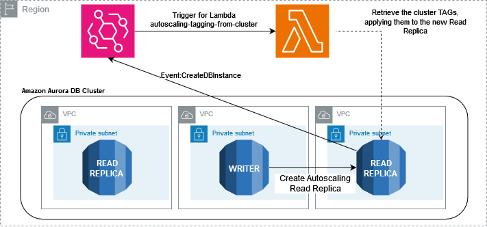

## Automatic Autoscaling Tagging from Database Cluster

Currently, Aurora Autoscaling does not extend the cluster tags to the Read-Replicas dynamically created.
Customers would like to extend cluster tags to all autoscaling read replicas created from "Add Replica Auto Scaling" for several reasons,such as cost allocation purposes.

## How does it work?
When the autoscaling read replica is created, a CreateDBInstance event is generated and it can be captured by EventBridge with the corresponding rule.
The rule will trigger a lambda function that makes some checks to verify if it is an autoscaling event. Then, it extracts the cluster name from the autoscaling instance event Tags, to retrieve the corresponding cluster identifier to read the tags which are applied to the autoscaling instance.

| :-------------:|
||
## Instructions

### Step 1. Create a new policy
Create a new IAM policy **autoscaling-tagging-policy** to allow the following actions related to RDS
```
{
    "Version": "2012-10-17",
    "Statement": [
        {
            "Sid": "autoscaling-tagging-policy",
            "Effect": "Allow",
            "Action": [
                "rds:AddTagsToResource",
                "rds:DescribeDBInstances",
                "rds:DescribeDBClusters",
                "rds:ListTagsForResource"
            ],
            "Resource": "*"
        }
    ]
}
```

### Step 2. Create a Lambda function
Create a Lambda with
- **Function name:** *aurora-autoscaling-tagging-from-cluster*
- **Runtime:** *Python 3.12*
  
while leaving the other parameters as default.
Once the function has been created, copy the code available in **automatic-autoscaling-tagging-from-dabatase-cluster.py** and paste it in the lambda *Code* tab, then press *Deploy* to commit the changes.

Then, move into the Lambda *configuration* tab, on the left select the *Permissions* and click on the *Role name* which looks like *automatic-autoscaling-tagging-from-dabatase-cluste-role-a1b2c3d4*, click on *Attach Policy*, type in the search bar *autoscaling-tagging-policy*, tick the policy called *autoscaling-tagging-policy* and press "Add permissions".

### Step 3. Create an EventBridge rule 
Go to EventBridge, select *Rule* on the left menu and press **Create Rule**.
Define the Rule detail as follow:
- **Name:** Create-DB-Instance-Rule
- **Event bus:** default
- **Rule type:** Rule with an event pattern
  
Press *Next*. Now, scroll down to **Event pattern** and press **Edit Pattern** pasting the following rule
```
{
  "source": ["aws.rds"],
  "detail-type": ["RDS DB Instance Event"],
  "detail": {
    "EventCategories": ["creation"],
    "SourceType": ["DB_INSTANCE"],
    "Message": ["DB instance created"],
    "EventID": ["RDS-EVENT-0005"]
  }
}
```
Click on **{}Prettify** and click *Next*.

In the **Select target(s)** window
- **Target Type:** AWS service
- **Select Target:** Lambda Function
- **Function:** aurora-autoscaling-tagging-from-cluster

press *Next*, and again *Next*, review the rule and press *Finish*.

## Security

See [CONTRIBUTING](CONTRIBUTING.md#security-issue-notifications) for more information.

## License

This library is licensed under the MIT-0 License. See the LICENSE file.

